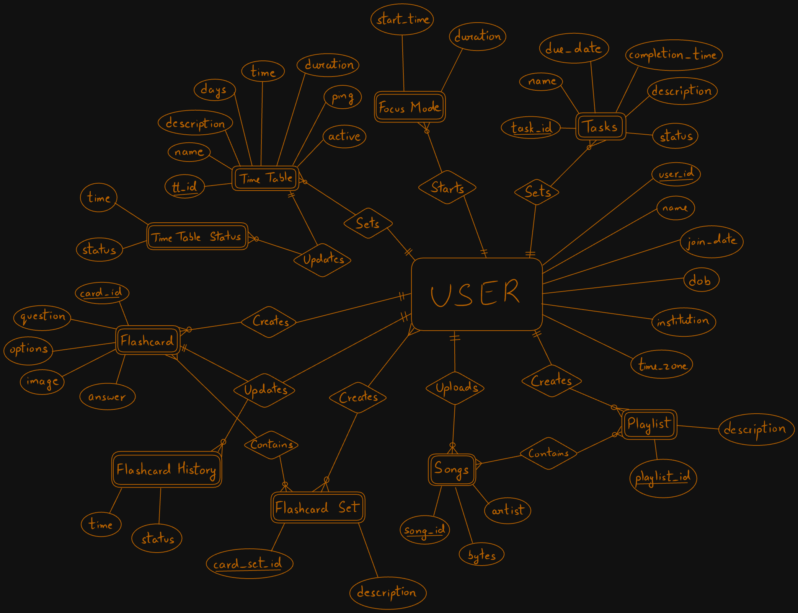

# Study Tracker Discord Bot

## 1. Project Planning

### Project Title:
Study Tracker Discord Bot

### Define Objectives:
The objective of the Study Tracker Discord Bot is to help users manage their study schedules, tasks, and focus modes through a Discord bot interface. The system should allow users to create and manage tasks, track their study time, and maintain playlists for study sessions.

## 2. Requirement Analysis

### System Specification:
- **Functional Requirements:**
  - Users should be able to create, read, update, and delete tasks.
  - Users should be able to start and stop focus modes.
  - Users should be able to create and manage playlists and songs.
  - The bot should provide reminders and notifications for tasks and focus modes.
  - The bot should maintain a history of completed tasks and focus sessions.

- **Non-Functional Requirements:**
  - **Performance:** The system should handle multiple users and concurrent operations efficiently.
  - **Security:** User data should be securely stored and accessed.

### Data Requirements:
- **Types of Data:**
  - User information (user_id, username, join_date)
  - Tasks (task_id, user_id, name, description, status, due_date, completion_time)
  - Focus modes (user_id, start, duration, status)
  - Playlists (playlist_id, user_id)
  - Songs (song_id, bytes, artist)
  - Card sets and cards for study materials

- **Relationships:**
  - Users have multiple tasks, focus modes, playlists, and card sets.
  - Playlists contain multiple songs.
  - Card sets contain multiple cards.

- **Constraints:**
  - Primary keys and foreign keys to maintain data integrity.
  - Unique constraints on user_id, task_id, playlist_id, and song_id.

## 3. Database Design

### Conceptual Design:
The Entity-Relationship (ER) diagram visualizes the entities, attributes, and relationships. Here is a textual representation based on the provided context:

- **Users** (user_id (PK), username, join_date)
  - (1:N) Tasks (task_id (PK), user_id (FK), name, description, status, due_date, completion_time)
  - (1:N) TimeTableEntry (tt_id (PK), user_id (FK), name, description, days, time, duration, ping)
    - (1:N) TimeTableCompletedEntries (tt_id (FK), time, status)
  - (1:1) FocusMode (user_id (FK), start, duration, status)
  - (1:N) Playlist (playlist_id (PK), user_id (FK))
    - (1:N) SongEntry (playlist_id (FK), song_id)
      - (N:1) Songs (song_id (PK), bytes, artist)
  - (1:N) CardSet (card_set_id (PK), user_id (FK))
    - (1:N) CardEntry (card_set_id (FK), card_id)
      - (N:1) Cards (card_id (PK), question, answer, card_type)
        - (1:1) DropdownCards (card_id (FK), option)
    <br>
### ER Overview:
```plaintext
Users (user_id (PK), username, join_date) // Strong Entity
    |
    |<-- (1:N) -- Tasks (task_id (PK), user_id (FK), name, description, status, due_date, completion_time) // Strong Entity
    |
    |<-- (1:N) -- TimeTableEntry (tt_id (PK), user_id (FK), name, description, days, time, duration, ping) // Strong Entity
    |                |
    |                |<-- (1:N) -- TimeTableCompletedEntries (tt_id (FK), time, status) // Weak Entity
    |
    |<-- (1:N) -- FocusMode (user_id (FK), start, duration) // Weak Entity
    |
    |<-- (1:N) -- Playlist (playlist_id (PK), user_id (FK)) // Strong Entity
    |                |
    |                |<-- (1:N) -- SongEntry (playlist_id (FK), song_id) // Junction table for m:n relations. Represent this as a m:n relation
    |                                |
    |                                |<-- (N:1) -- Songs (song_id (PK), bytes, artist) // Strong Entity
    |
    |   
    | 
    |<-- (1:N) -- CardSet (card_set_id (PK), user_id (FK)) // Strong Entity
    |               |
                    |<-- (1:N) -- CardEntry (card_set_id (FK), card_id) // Junction table for m:n relations. Represent this as a m:n relation
                                    |
                                    |<-- (N:1) -- Cards (card_id (PK), question, answer, card_type) // Strong Entity
                                                    |
                                                    |<-- (1:1) -- DropdownCards (card_id (FK), option) // Weak Entity
                                                    |
                                                    |<-- (1:N) -- CardHistory (card_id (FK), time, status) // Weak Entity
```

 
  
### ER Diagram:




### Logical Design:
Convert the ER diagram into a relational schema:

- **Users**:
  ```sql
  CREATE TABLE Users (
      user_id BIGINT PRIMARY KEY,
      username VARCHAR(64) NOT NULL,
      join_date BIGINT NOT NULL
  );
  ```

- **Tasks**:
  ```sql
  CREATE TABLE Tasks (
      task_id BIGINT PRIMARY KEY,
      user_id BIGINT NOT NULL,
      name VARCHAR(128) NOT NULL,
      description TEXT,
      status VARCHAR(32),
      due_date BIGINT,
      completion_time BIGINT,
      FOREIGN KEY (user_id) REFERENCES Users(user_id)
  );
  ```

- **FocusMode**:
  ```sql
  CREATE TABLE FocusMode (
      user_id BIGINT,
      start BIGINT NOT NULL,
      duration BIGINT,
      status BOOLEAN,
      PRIMARY KEY (user_id, start),
      FOREIGN KEY (user_id) REFERENCES Users(user_id)
  );
  ```

- **Playlist**:
  ```sql
  CREATE TABLE Playlist (
      playlist_id BIGINT PRIMARY KEY,
      user_id BIGINT NOT NULL,
      FOREIGN KEY (user_id) REFERENCES Users(user_id)
  );
  ```

- **Songs**:
  ```sql
  CREATE TABLE Songs (
      song_id BIGINT PRIMARY KEY,
      bytes BLOB NOT NULL,
      artist VARCHAR(128)
  );
  ```

- **CardSet**:
  ```sql
  CREATE TABLE CardSet (
      card_set_id BIGINT PRIMARY KEY,
      user_id BIGINT NOT NULL,
      FOREIGN KEY (user_id) REFERENCES Users(user_id)
  );
  ```

- **Cards**:
  ```sql
  CREATE TABLE Cards (
      card_id BIGINT PRIMARY KEY,
      question TEXT,
      answer TEXT,
      card_type VARCHAR(64)
  );
  ```

- **DropdownCards**:
  ```sql
  CREATE TABLE DropdownCards (
      card_id BIGINT PRIMARY KEY,
      option VARCHAR(256),
      FOREIGN KEY (card_id) REFERENCES Cards(card_id)
  );
  ```

### Normalization:
The database is normalized up to the third normal form (3NF) to reduce redundancy and improve integrity.

## 4. Implementation

### Database Creation:
The database and tables are created using SQL queries as shown in the logical design section.

### Coding:
 SQL queries for CRUD operations. Example for tasks:
```sql
-- Create
INSERT INTO Tasks (task_id, user_id, name, description, status, due_date, completion_time) VALUES (?, ?, ?, ?, ?, ?, ?);

-- Read
SELECT * FROM Tasks WHERE user_id = ?;

-- Update
UPDATE Tasks SET name = ?, description = ?, status = ?, due_date = ?, completion_time = ? WHERE task_id = ?;

-- Delete
DELETE FROM Tasks WHERE task_id = ?;
```
However in this project these operations are performed internally by discord through the python functions we have written

 

### User Interface (UI) Design:
  For this project, the UI is implemented as a Discord bot using the `discord.py` python library.


### Technologies Used 

**Front End**:
 - Using discord.py and discord
 **Back End**:
 - Using pyscop2.py, a PostgreSQL  framework for python
 **API**:
 - Gemini Flash 1.5  API along with google.genai module in python
 **Python requirements.txt File**:
```txt
python-dotenv

discord

discord.py

psycopg2

google-generativeai

python-dateutil
 
```


## 5. Testing and Validation

### Test Cases:
- **Task Management:**
  - Create a task and verify it appears in the database.
  - Update a task and check if changes are reflected.
  - Delete a task and ensure it is removed from the database.
  - Retrieve tasks for a user and ensure correct data is fetched.

- **Focus Mode:**
  - Start a focus mode session and check if it's recorded.
  - End a focus mode session and verify if the status is updated.

- **Playlist Management:**
  - Create a playlist and add songs, then verify through fetching.
  - Update playlist details and check for changes.
  - Delete a playlist and ensure all related songs are also handled.

- **Notifications and Reminders:**
  - Set a reminder for a task and check if the notification is triggered at the right time.
  - Start a focus mode and verify if a reminder is sent when the session is about to end.

### Validation:
- **Functional Validation:**  All functionalities such as task creation, updating, deletion, and notifications work as intended.
- **Performance Validation:** The bot handles multiple users and concurrent operations efficiently.
- **Security Validation:** The data is securely handled with user verification.

## 6. User Manual

### Set Up
**Go to our GitHub at https://github.com/ShaunAlanJoseph/Study-Tracker-Discord-Bot and follow the set up instructions**

### Prerequisites

- Python 3.6 or higher
- A Discord account
- Access to the [Discord Developer Portal](https://discord.com/developers/applications) to create a bot
- Gemini API access

### Installation

1. **Clone the repository:**

   ```bash
   git clone https://github.com/ShaunAlanJoseph/Study-Tracker-Discord-Bot.git
   ```

2. **Install Dependancies:**
```bash
pip install -r requirements.txt
```
3.  **Create a `.env` file in the root directory of the project and add the following lines:**
```
DISCORD_API_TOKEN=<Your_Discord_Bot_Token>
Gemini_API_Key=<Your_Gemini_API_Key>


ADMIN_CHANNEL_ID=<admin channel id>

DB_URL=<postgres db url>

DB_PORT=<postgres port>

DB_NAME=<your database name>

DB_USER=<your username>

DB_PASS=<your password>


```

4. **Run the bot:**
```bash
python bot.py
```

### Using the bot
- Command prefix is $
- Write !help to ask Gemini AI for help regarding any of the commands .Alternatively you can use $help to see a list of available commands

```
Study Tracker Commands

List of available commands and their usage

$ping

Responds with 'Pong!' and alternates messages.

$add_flashcard

Adds a new flashcard.

$list_flashcards

Lists all flashcards.

$flashcard_flash

Flashes a specific flashcard by ID.

$add_task

Adds a new task with a specified name.

$set_task

Sets the current task by name.

$set_task_by_id

Sets the current task by ID.

$add_description

Adds a description to the current task.

$list_tasks

Lists all tasks.

$remove_task

Removes a task by name.

$delete_task

Deletes a task by ID.

$mark_as_done

Marks a task as done by name.

$mark_as_started

Marks a task as started by name.

$mark_as_started_by_id

Marks a task as started by ID.

$mark_as_done_by_id

Marks a task as done by ID.

$set_due_date

Sets a due date for the current task.Format should be YYYY-MM-DD HH:MM:SS.

$query

Queries the Gemini API with your question and returns a response.

$pm

Sends a private message to you asking how the bot can help and you can talk to it.

$gemini enable

Enables Gemini to respond to every message in the server.

$gemini disable

Disables Gemini from responding to every message in the server.

!help <question> to ask a question related to the commands to the bot. 

```


-----------------------------------------------**THE END**----------------------------------------------------
  
